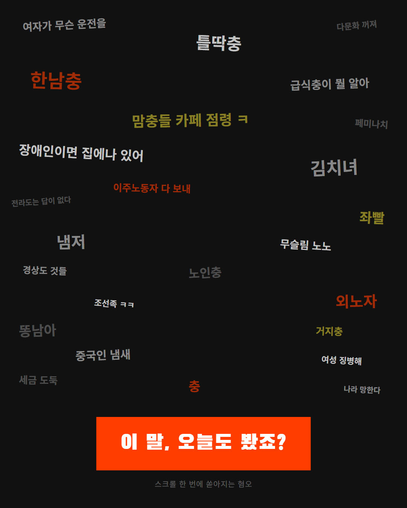
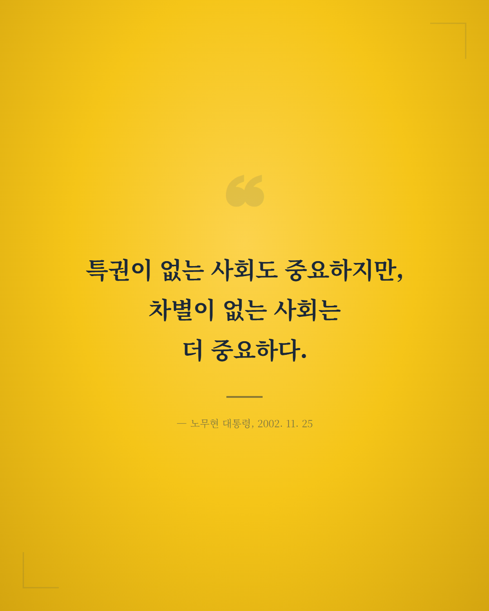
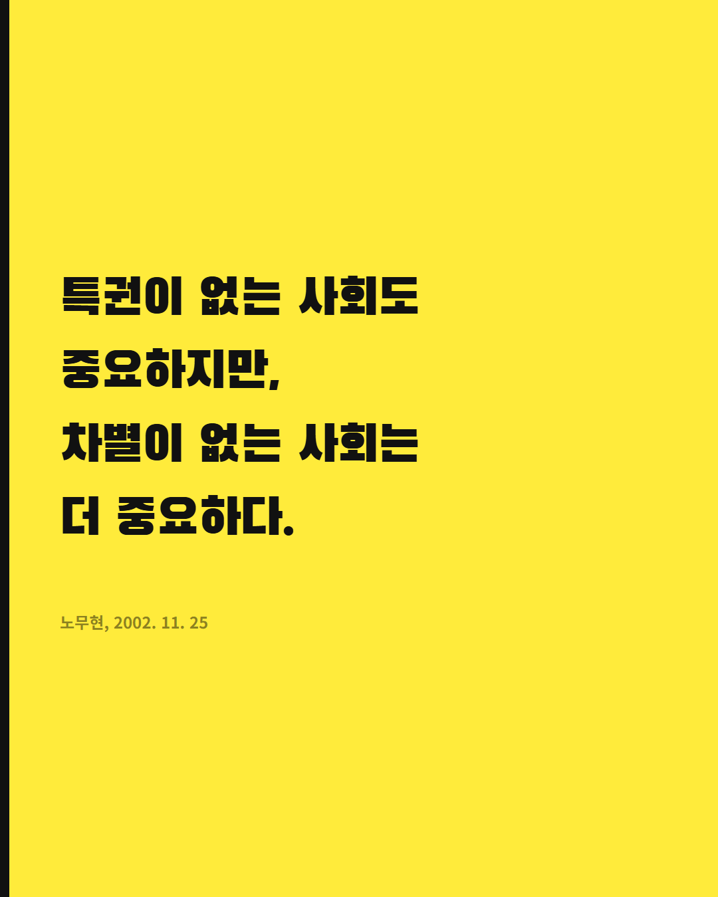
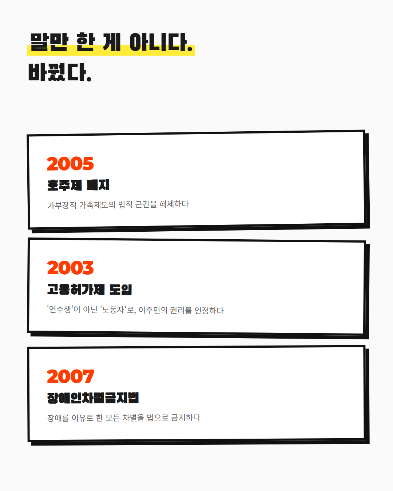
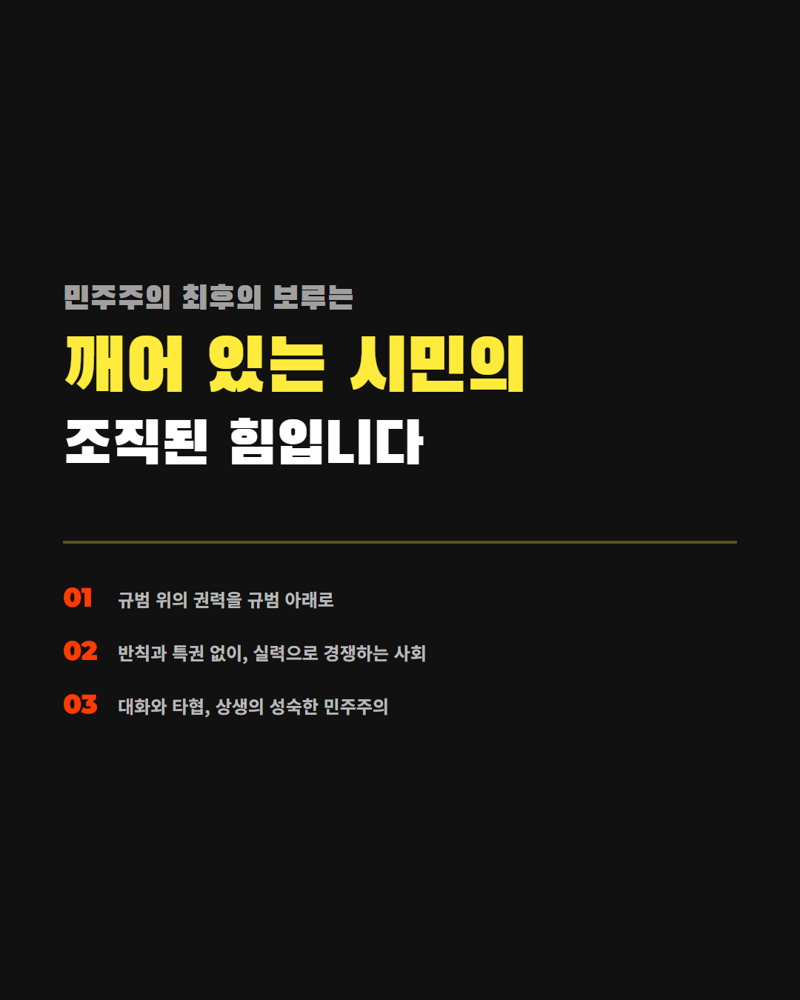
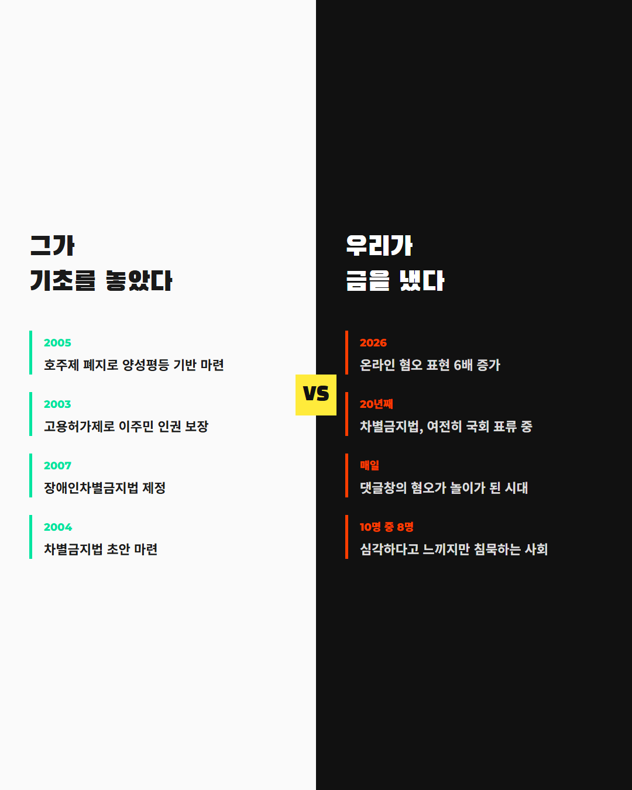
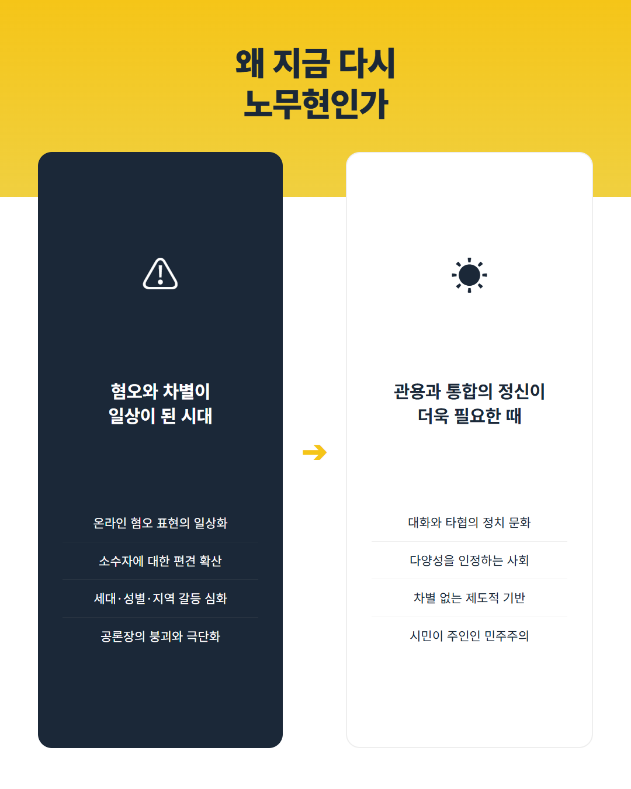
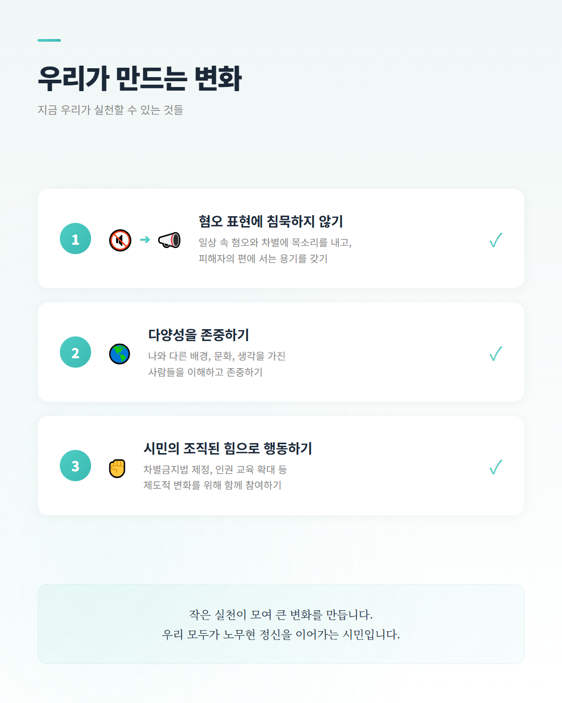

# 다시 보는 노무현 정신 — 혐오와 차별을 넘어

**노무현재단 2026 콘텐츠랩 공모전 출품작 (카드뉴스)**

---

## 작품 소개

인권변호사 노무현에서 대통령 노무현까지, 차별 없는 사회를 향한 그의 발자취를 되짚고 오늘날 혐오와 차별의 현실 속에서 우리가 실천할 수 있는 변화를 제안하는 카드뉴스입니다.

## 카드뉴스 구성 (총 10장)

| 슬라이드 | 내용 |
|---------|------|
| 1 | 표지 — 다시 보는 노무현 정신 |
| 2 | 인권변호사 노무현 (1981 부림사건) |
| 3 | 핵심 명언 — "차별이 없는 사회는 더 중요하다" |
| 4 | 차별 없는 나라를 꿈꾸다 (인권 정책 성과) |
| 5 | 다문화사회의 문을 열다 (이주민 정책) |
| 6 | 민주주의의 핵심 가치 (대화·타협·관용·통합) |
| 7 | 지금, 우리 사회의 현실 (혐오·차별 현황) |
| 8 | 왜 지금 다시 노무현인가 |
| 9 | 우리가 만드는 변화 (실천 방안) |
| 10 | 마무리 — 사람 사는 세상 |

---

